<div align="center">



<br/>


</div>


<table>
<tr>
<td width="62%" valign="top">

```ts
const masterDev = {
  role:      "Junior Developer",
  degree:    "Computer Engineer",
  focus:     ["Web", "Web Apps"],
  loves:     "exploring new frameworks & plugins",
  learning:  ["Next.js", "TypeScript", "Astro"],
  lookingFor: "new challenges & collabs",
  contact:   "master_bc@icloud.com",
};
```

</td>
<td width="38%" align="center" valign="middle">


</td>
</tr>
</table>





<div align="center">


</div>


<div align="center">
  
</div>


<div align="center">

<a href="https://github.com/Iampro1712"></a>
<a href="https://instagram.com/eduard0x.rm"></a>
<a href="https://tiktok.com/@mast3rsk"></a>
<a href="mailto:master_bc@icloud.com"></a>
<a href="https://paypal.me/edu1706"></a>

<br/><br/>


</div>
